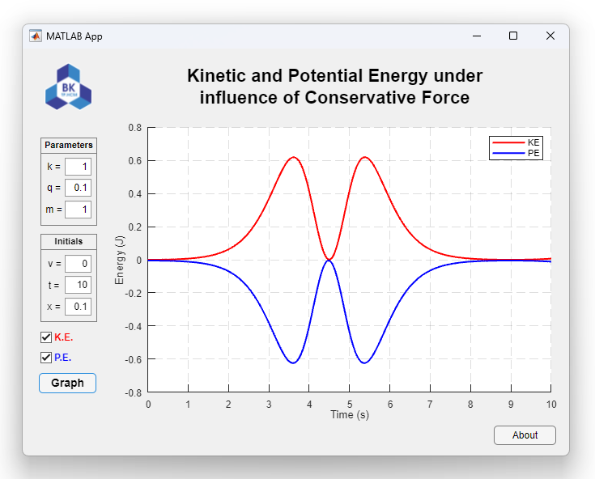

# MATLAB-Conservative-Force-Energy-Analysis

## About

This MATLAB project provides a tool for analyzing the energy of a particle under the influence of conservative forces. The conservative force is defined by an expression that depends only on the starting and ending positions of the particle's motion, and the potential energy can be calculated using this expression. The project includes both a script and a GUI for calculating the kinetic and potential energy of the particle as functions of time and provides a graphical representation of the results.

## Disclaimer

This project is for educational purposes only and should not be used for commercial or personal gain. You may use this project as a reference for learning or research purposes, but you may not copy, modify, or distribute the code for your own purposes. It is not responsible for any damages or liabilities that may arise from the use of this project.

## Requirements

- [MATLAB R2019b or later](https://www.mathworks.com/products/matlab.html)
- [MATLAB Symbolic Math Toolbox](https://www.mathworks.com/products/symbolic.html)

## Getting Started

1. Clone the repository to your local machine.
2. Run the [app.mlapp](https://github.com/datdadev/MATLAB-Conservative-Force-Energy-Analysis/blob/main/app.mlapp) GUI file by typing `app` in the command window.
3. In the GUI window, enter the initial position, velocity, mass, and conservative force parameters.
4. Click the "Graph" button in the GUI window to compute the kinetic and potential energies of the particle and plot them on the GUI.
5. Experiment with different parameter values by adjusting the sliders and clicking the "Graph" button again.

## Credits

- [MathWorks](https://www.mathworks.com/) for providing MATLAB and Symbolic Math Toolbox.
- [Dr. Nguyen Xuan Thanh Tram](https://fas.hcmut.edu.vn/personnel/nxttram) at [Ho Chi Minh City University of Technology](https://hcmut.edu.vn) for providing guidance and support for this project.
- A. L. Garcia and C. Penland, authors of *MATLAB Projects for Scientists and Engineers*, for their valuable insights and resources. The book can be found at: http://www.algarcia.org/fishbane/fishbane.html.
- The [MATLAB Central File Exchange community](https://www.mathworks.com/matlabcentral/fileexchange/2268-projects-for-scientists-and-engineers) for providing useful MATLAB code and resources for scientists and engineers.
